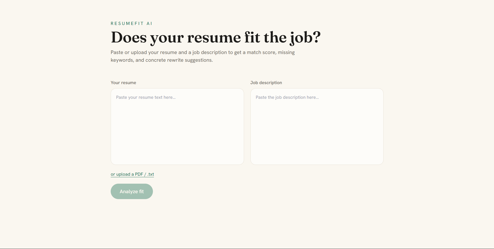

# ResumeFit AI 🎯

> AI-powered Resume / Job-Fit Analyzer. Paste your resume and a job description to get a match score, missing keywords, and rewrite suggestions for weak bullet points.

🔗 **Live Demo:** _<add your deployed URL here>_



---

## ✨ Features

- **Match score (0–100)** between a resume and a target job description
- **Missing keywords / skills** the resume should mention
- **Rewrite suggestions** for weak resume bullets
- **Analysis history** (when logged in) *(optional)*
- Clean, responsive UI

---

## 🛠 Tech Stack

**Frontend:** React · Vite · TypeScript · Tailwind CSS
**Backend:** Python · FastAPI
**Database:** PostgreSQL · SQLModel
**AI:** Google Gemini API (Gemini 2.5 Flash)
**Deploy:** Vercel · Render · Neon

<!-- Optional shields.io badges:


-->

---

## ⚙️ How It Works

1. The user submits a resume and a job description from the React frontend.
2. FastAPI sends a structured prompt to the Gemini API.
3. Gemini returns a JSON report (score, missing keywords, suggestions).
4. The frontend renders the report; logged-in users have it saved to PostgreSQL.

---

## 🚀 Getting Started (Local)

### Prerequisites
- Node.js 18+
- Python 3.11+
- A free [Gemini API key](https://ai.google.dev)

### Backend
```bash
cd backend
python -m venv venv && source venv/bin/activate   # Windows: venv\Scripts\activate
pip install -r requirements.txt
cp .env.example .env        # then add your GEMINI_API_KEY
uvicorn main:app --reload
```
API docs available at `http://localhost:8000/docs`.

### Frontend
```bash
cd frontend
npm install
npm run dev
```
App runs at `http://localhost:5173`.

---

## 🔑 Environment Variables

| Variable | Description |
|----------|-------------|
| `GEMINI_API_KEY` | Your Google Gemini API key |
| `DATABASE_URL` | PostgreSQL connection string (optional) |

---

## 📌 API

| Method | Endpoint | Description |
|--------|----------|-------------|
| `POST` | `/analyze` | Returns a match report for a resume + job description |

---

## 🗺 Roadmap

- [ ] PDF/`.txt` resume upload
- [ ] User accounts + analysis history
- [ ] PDF export of reports
- [ ] Compare one resume against multiple jobs

---

## 👤 Author

**<Your Name>** — _<portfolio / LinkedIn / email>_

Built as a portfolio project to demonstrate full-stack development with an AI integration.
